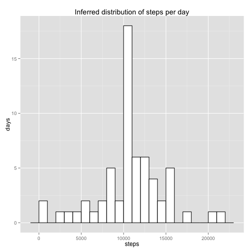

# Reproducible Research: Peer Assessment 1


## Loading and preprocessing the data

```r
# Import the data from the csv file
activity <- read.csv("activity.csv")
# Extract the rows for which steps is not na
activity_real_counts <- activity[!is.na(activity[, 1]), ]
# Load ggplot2 for plotting
library(ggplot2)
```


## What is mean total number of steps taken per day?

```r
# Find the total steps per day
steps_per_day <- data.frame(steps = sapply(split(activity_real_counts$steps, 
    activity_real_counts$date), sum))
# Mean number of steps:
mean_steps_per_day <- mean(steps_per_day$steps)
# Median number of steps
median_steps_per_day <- median(steps_per_day$steps)
# Histogram of number of steps
ggplot(steps_per_day, aes(x = steps)) + geom_histogram(binwidth = 1000, colour = "black", 
    fill = "white") + ylab("days") + ggtitle("Distribution of steps per day")
```

 

The mean number of steps per day is 9354.2295.

The median number of steps per day is 10395.

Both of these values were computed by simply excluding any missing values. Days on which no steps were recorded were nevertheless included in the calculation of the mean and median.

## What is the average daily activity pattern?

```r
# Split the data by 5-minute intervals
intervals <- split(activity_real_counts$steps, activity_real_counts$interval)
# Find the means
interval_means <- sapply(intervals, mean)
# Convert to a data frame for plotting
interval_frame <- data.frame(labels = as.numeric(names(intervals)), means = interval_means)
ggplot(interval_frame, aes(x = labels, y = means, colour = "r")) + geom_line() + 
    geom_point() + xlab("Interval") + ylab("Mean number of steps") + ggtitle("Average daily activity pattern") + 
    theme(legend.position = "none")
```

 

```r
# Highest-activity interval
max_activity <- max(interval_frame$means)
max_activity_interval <- interval_frame$labels[interval_frame$means == max_activity]
```

The 5-minute activity containing, on average, the most steps is interval 835.

## Imputing missing values

```r
# Number of missing values
num_missing_values <- sum(is.na(activity[, 1]))
```

The number of missing values in the data set is 2304.

Missing values tend to be concentrated within individual days; there are a few days with mostly or entirely NA's, so filling in values for those days based on intra-day statistics seems unreliable; we would be inferring data from few or no real points. Instead, we will infer values based on the 5-minute interval means across those days for which each interval contained real data.


```r
# Make a copy of the original data frame
inferred_steps <- data.frame(steps = activity$steps, date = activity$date, interval = activity$interval)
# Fill in missing values in inferred_activity$steps with the corresponding
# 5-minute interval mean
days <- rownames(steps_per_day)
num_days <- length(days)
for (i in 1:num_days) {
    temp_day <- inferred_steps[inferred_steps$date == days[i], ]
    for (j in 1:length(temp_day[, 1])) {
        if (is.na(temp_day[j, "steps"])) {
            temp_day[j, "steps"] <- interval_means[j]
        }
    }
    inferred_steps[inferred_steps$date == days[i], ] <- temp_day
}

# Find the inferred total steps per day
inferred_steps_per_day <- data.frame(steps = sapply(split(inferred_steps$steps, 
    inferred_steps$date), sum))
# Mean inferred number of steps:
inferred_mean_steps_per_day <- mean(inferred_steps_per_day$steps)
# Median inferred number of steps
inferred_median_steps_per_day <- median(inferred_steps_per_day$steps)
# Histogram of inferred number of steps
ggplot(inferred_steps_per_day, aes(x = steps)) + geom_histogram(binwidth = 1000, 
    colour = "black", fill = "white") + ylab("days") + ggtitle("Inferred distribution of steps per day")
```

 

The inferred mean number of steps per day is 1.0766 &times; 10<sup>4</sup>.

The inferred median number of steps per day is 1.0766 &times; 10<sup>4</sup>.

Inferring missing values according to the 5-minute interval means increased the mean number of steps per day by around 700, or 7%. The median number of steps per day decreased by around 300.

## Are there differences in activity patterns between weekdays and weekends?

```r
# Add a factor with value 'weekend' if the date is a Saturday or Sunday and
# value 'weekday' otherwise Binary vector TRUE when date is a Saturday
saturdays <- weekdays(as.Date(inferred_steps$date)) == "Saturday"
# Binary vector TRUE when date is a Sunday
sundays <- weekdays(as.Date(inferred_steps$date)) == "Sunday"
# Saturday or Sunday
weekend_days <- saturdays + sundays
# Vector indicating 'weekday' or 'weekend'
days <- rep(c(""), length(weekend_days))
days[weekend_days == 1] = "weekend"
days[weekend_days == 0] = "weekday"
# Add the factor to the data frame
inferred_steps$day <- days

# Find weekend and weekday 5-minute interval means Split the data by
# 5-minute intervals
weekday_intervals <- split(inferred_steps$steps[inferred_steps$day == "weekday"], 
    inferred_steps$interval[inferred_steps$day == "weekday"])
weekend_intervals <- split(inferred_steps$steps[inferred_steps$day == "weekend"], 
    inferred_steps$interval[inferred_steps$day == "weekend"])
# Find the means
weekday_interval_means <- sapply(weekday_intervals, mean)
weekend_interval_means <- sapply(weekend_intervals, mean)
# Convert to a data frame for plotting
day_interval_frame <- data.frame(labels = as.numeric(c(names(weekday_intervals), 
    names(weekend_intervals))), means = c(weekday_interval_means, weekend_interval_means), 
    day = c(rep("weekday", length(weekday_interval_means)), rep("weekend", length(weekend_interval_means))))

ggplot(day_interval_frame, aes(x = labels, y = means, colour = "r")) + geom_line() + 
    geom_point() + xlab("Interval") + ylab("Mean number of steps") + ggtitle("Average weekday activity pattern") + 
    theme(legend.position = "none") + facet_grid(day ~ .)
```

 

